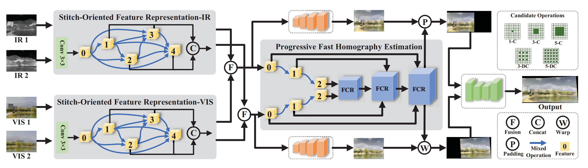

# Towards All Weather and Unobstructed Multi-Spectral Image Stitching: Algorithm and Benchmark


Zhiying Jiang, Zengxi Zhang, Xin Fan, Guanyao Wu, Risheng Liu* ,**“Towards All Weather and Unobstructed Multi-Spectral Image Stitching: Algorithm and Benchmark”**, Proceedings of the 30th ACM International Conference on Multimedia **(ACMMM)**, 2022. [*[paper]*](https://dl.acm.org/doi/abs/10.1145/3503161.3547966)
## Overview


## Download

Download the pre-trained model and put it in /checkpoints
  - [Google Drive](https://drive.google.com/file/d/122YwzPq3JvQGbvs5sMw0R-yNrjxiuEQZ/view?usp=sharing)
  - [Baidu Yun](https://pan.baidu.com/s/1X0FxjHXefv6DyjZ4tC85Ig?pwd=eufg)


## Install
We recommend you to use the conda management environment. \
Clone this repo:
```
conda create -n MSIS-Net python=3.9
conda activate MSIS-Net
conda install tensorflow-gpu=2.4.1
pip install -r requirements.txt
```
## Test
### Step 1: Generate aligned images
Modidy the 'H_estimation/test.py' to set the 'device' and 'data_root'.  
generate aligned images by estimating homography matrix:
```
cd H_estimation
python test.py
```
The generated images are used to the subsequent reconstruction.

### Step 2: Generate stitched images
Modidy the 'Reconstruction/test.py' to set the 'device' and 'data_root'.  
generate stitched images:
```
cd ../Reconstruction
python test.py
```
## Dataset (MSIS dataset)
The dataset will be posted soon...

## Citation
```
@inproceedings{jiang2022towards,
  title={Towards all weather and unobstructed multi-spectral image stitching: Algorithm and benchmark},
  author={Jiang, Zhiying and Zhang, Zengxi and Fan, Xin and Liu, Risheng},
  booktitle={Proceedings of the 30th ACM International Conference on Multimedia},
  pages={3783--3791},
  year={2022}
}
```
## Contact
If you have any question or suggestion about the dataset, please email to [Zengxi Zhang](cyouzoukyuu@gmail.com) or [Zhiying Jiang](zyjiang0630@gmail.com).
